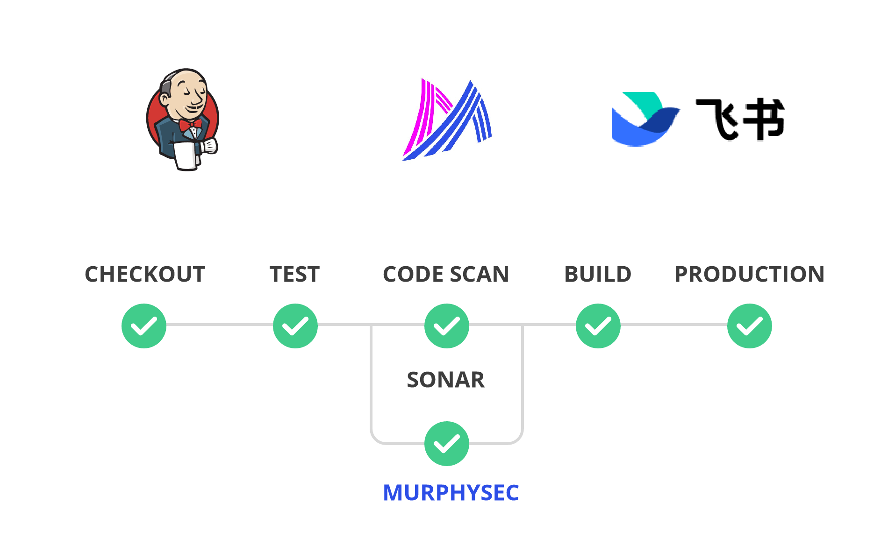
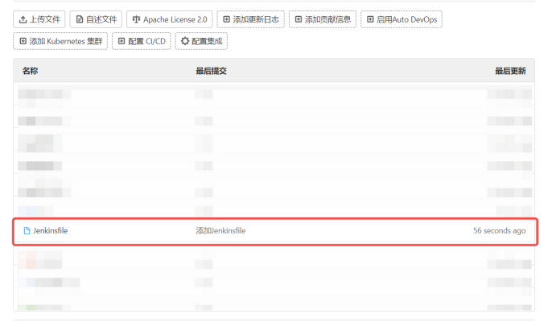
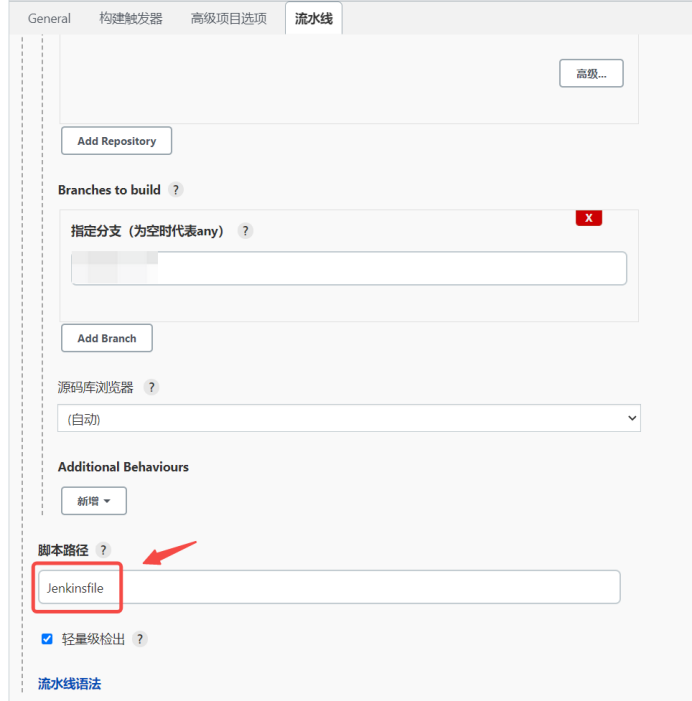
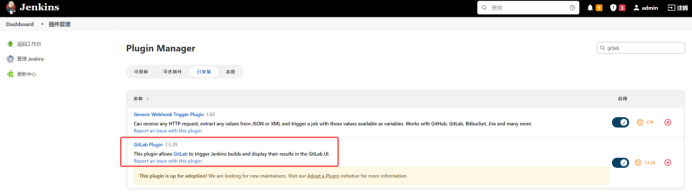
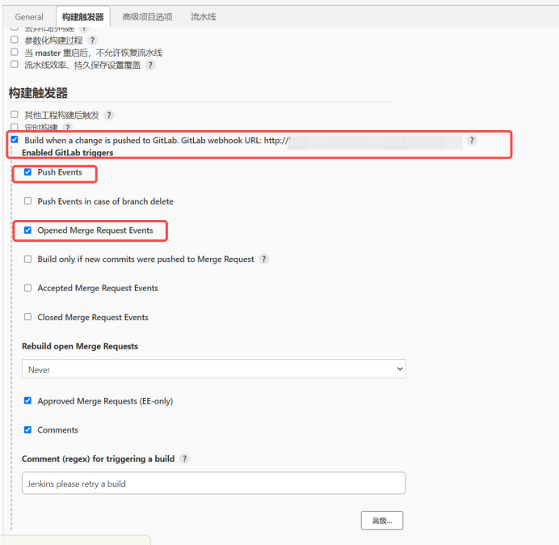
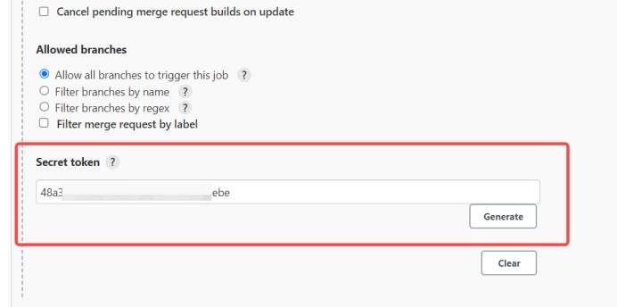
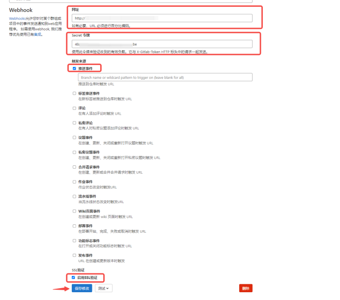
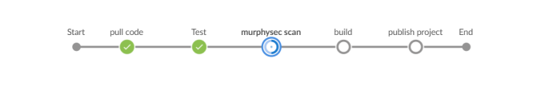
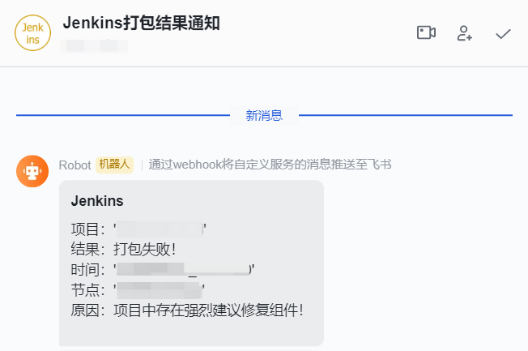

# murphysec-jenkins-tools

> 将墨菲安全的代码检测能力集成到 Jenkins 中，提高线上代码安全质量

## 概述

Jenkins 是企业广泛使用的持续集成项目，将代码安全检测能力集成到 Jenkins 中，实现代码打包前即对代码进行安全扫描，降低线上代码因安全问题导致的公司数据泄漏风险，同时也会减少项目发布时的压力。且持续集成中的任何一个环节都是自动完成的，无需太多人工干预，有利于减少重复过程以节省时间和工作量。

## 实现效果

1. 每次 Jenkins 构建的时候自动检测代码中存在的三方开源组件，并识别漏洞
2. 配置规则，识别到严重漏洞就中断构建
3. 结果推送到飞书群中，相关工程师都能看到

## 集成方式

### 1. 配置 Jenkinsfile

- 在项目根目录放置 `Jenkinsfile` 文件

- [Jenkinsfile 代码实例](./Jenkinsfile)

> 执行逻辑：代码下拉后，通过墨菲安全 CLI 对代码进行检测，然后使用 Linux 工具 `jq` 解析检查结果，如检测结果存在`强烈建议修复`级别的缺陷组件，则终止构建流程。

- [飞书消息通知脚本示例](./feishu.sh)

### 2. Jenkins上设置脚本路径

- 在 Jenkins 后台找到项目后，配置管理 `Advanced Project Options` -> `Pipeline` -> `Script Path = Jenkinsfile` ，这样 Jenkins CI 执行的时候，pipline 流程就会执行 Jenkinsfile 里的逻辑。

### 3. Jenkins 设置 Webhook

- 配置 Webhooks 以便项目在更新后，能够自动触发 Jenkins（Jenkins 需安装插件 Git、GitLab Plugin）

- 构建触发器勾选 `Build when a changs is ...` 选项，该 URL 在 GitLab 项目 Webhooks 中会用到

- 创建 Secret token，用于 GitLab Webhooks 做验证

### 4. GitLab 设置 Webhook

- 将 Jenkins 设置 Webhook 时获取到的 `URL` 和 `Secret token` 设置在 GitLab 中

### 5. 飞书通知

- 做好异常处理，某个stage抛出异常后，要及时做出通知，避免影响打包。下图为构建流程：

- 调用飞书机器人 Webhook 将构建结果发送到群内。当项目检测未通过时，可以在后台将检测结果导入发送给开发人员做修复参考。
